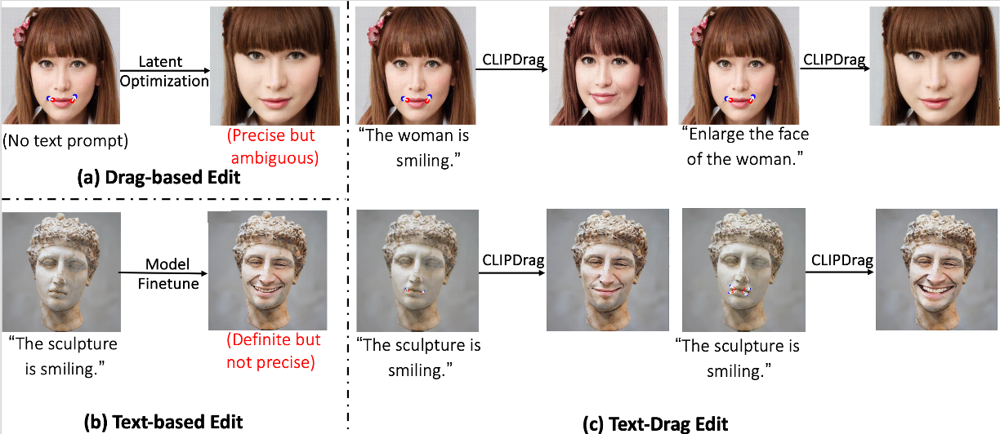
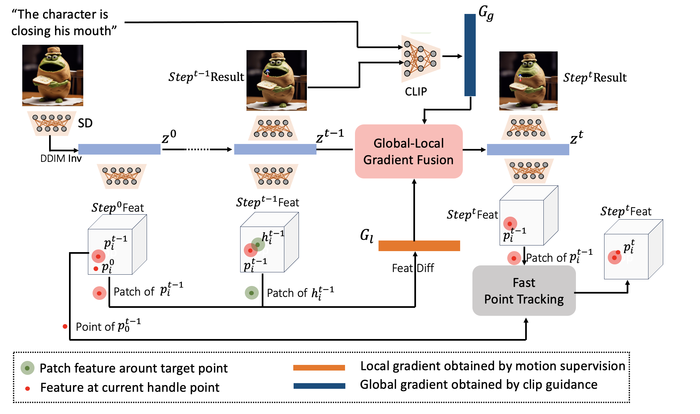
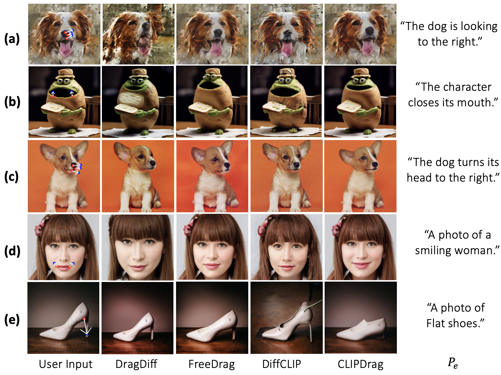
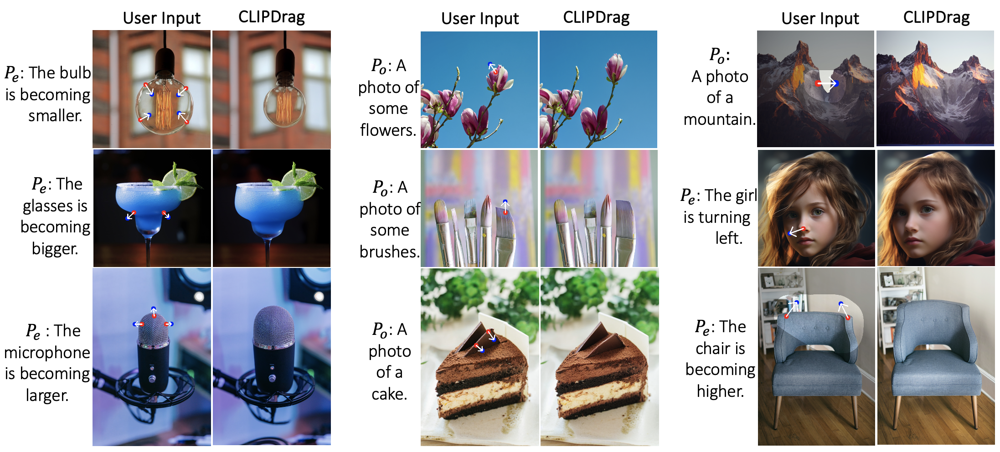

<p align="center">
  <h1 align="center">CLIPDrag: Combining Text-based and Drag-based Editing for Precise and Flexible Image Editing </h1>
  <p align="center">
    <strong>Ziqi Jiang</strong>
    &nbsp;&nbsp;
    <strong>Zhen Wang</strong>
    &nbsp;&nbsp;
    <strong>Long Chen</strong>
    &nbsp;&nbsp;
  </p>
  <p align="center">
    <a href="https://arxiv.org/abs/2410.03097"></a>
  </p>
  <div align="center">
   
     
  </div>
<!--   <div align="center">
    
    
    
    
    <p align="left">&emsp;&emsp;&emsp;&emsp;&emsp;DragNoise&emsp;&emsp;&emsp;&emsp;&emsp;&emsp;&emsp;DragDiffusion&emsp;&emsp;&emsp;&emsp;&emsp;&emsp;&emsp;DragNoise&emsp;&emsp;&emsp;&emsp;&emsp;&emsp;&emsp;DragDiffusion</p>
  </div>
  <div align="center">
    
    
    
    
    <p align="left">&emsp;&emsp;&emsp;&emsp;&emsp;DragNoise&emsp;&emsp;&emsp;&emsp;&emsp;&emsp;&emsp;DragDiffusion&emsp;&emsp;&emsp;&emsp;&emsp;&emsp;&emsp;DragNoise&emsp;&emsp;&emsp;&emsp;&emsp;&emsp;&emsp;DragDiffusion</p>
  </div>
  <div align="center">
    
    
    
    
    <p align="left">&emsp;&emsp;&emsp;&emsp;&emsp;DragNoise&emsp;&emsp;&emsp;&emsp;&emsp;&emsp;&emsp;DragDiffusion&emsp;&emsp;&emsp;&emsp;&emsp;&emsp;&emsp;DragNoise&emsp;&emsp;&emsp;&emsp;&emsp;&emsp;&emsp;DragDiffusion</p>
  </div>
  <div align="center">
    
    
    
    
    <p align="left">&emsp;&emsp;&emsp;&emsp;&emsp;DragNoise&emsp;&emsp;&emsp;&emsp;&emsp;&emsp;&emsp;DragNoise&emsp;&emsp;&emsp;&emsp;&emsp;&emsp;&emsp;&emsp;DragNoise&emsp;&emsp;&emsp;&emsp;&emsp;&emsp;&emsp;DragNoise</p>
  </div> -->
</p>


## News and Update
* [Mar 19th] v2.0.0 Release.
* [Feb 9th] v1.0.0 Release.

## Installation

It is recommended to run our code on a Nvidia GPU with a linux system. Currently, it requires around 14 GB GPU memory to run our method.

To install the required libraries, simply run the following command:
```
conda env create -f environment.yaml
conda activate clipdrag
```
If this takes too long, ```conda config --set solver libmamba ``` sets conda to use the libmamba solver and could speed up installation. 

Make sure your gradio version is 3.50.2 if an error occurs in the GUI interface.

## Run CLIPDrag
To start with, in command line, run the following to start the gradio user interface:
```
python3 drag_ui.py
```
Basically, it consists of the following steps:

### Dragging Input Real Images
#### 1) train a LoRA
* Drop our input image into the left-most box.
* Input a prompt describing the image in the "lora prompt" field.(You can keep this empty.)
* Click the "Train LoRA" button to train a LoRA given the input image

#### 2) do "drag" editing
* Draw a mask in the left-most box to specify the editable areas. (optional)
* Click handle and target points in the middle box. Also, you may reset all points by clicking "Undo point".
* Input a prompt describing the desired edit in the "drag prompt" field.(You can keep this empty if no need for ambiguity elimination. In this situation, CLIPDrag will use  lora prompt to enhance the edit. )
* Click the "Run" button to run our algorithm. Edited results will be displayed in the right-most box.


## More result
<a id="more reault">
<div align="center">
    
    

  </div>
</a>

## License
Code related to the Drag algorithm is under Apache 2.0 license.


## BibTeX
If you find our repo helpful, please consider leaving a star or cite our paper :
```bibtex
@article{jiang2024combing,
  title={Combing Text-based and Drag-based Editing for Precise and Flexible Image Editing},
  author={Jiang, Ziqi and Wang, Zhen and Chen, Long},
  journal={arXiv preprint arXiv:2410.03097},
  year={2024}
}
```

## Contact
For any questions on this project, please contact zjiangbl@connect.ust.hk

## Acknowledgement
This work is inspired by the amazing [DragGAN](https://vcai.mpi-inf.mpg.de/projects/DragGAN/). We also benefit from the codebase of [DragDiffusion](https://github.com/Yujun-Shi/DragDiffusion). 
## Related Links
* [Drag Your GAN: Interactive Point-based Manipulation on the Generative Image Manifold](https://vcai.mpi-inf.mpg.de/projects/DragGAN/)
* [DragDiffusion: Harnessing Diffusion Models for Interactive Point-based Image Editing](https://github.com/Yujun-Shi/DragDiffusion)
* [Prompt-aligned Gradient for Prompt Tuning](https://openaccess.thecvf.com/content/ICCV2023/html/Zhu_Prompt-aligned_Gradient_for_Prompt_Tuning_ICCV_2023_paper.html)


